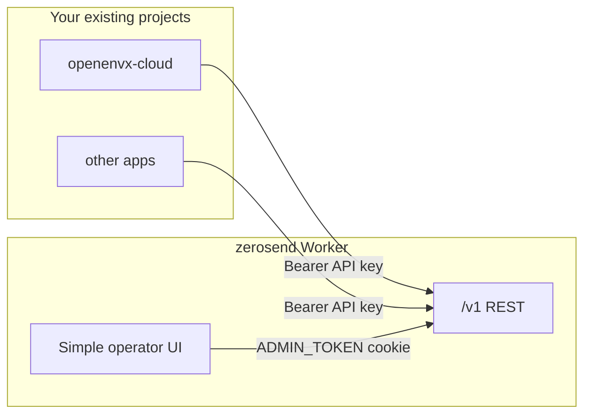
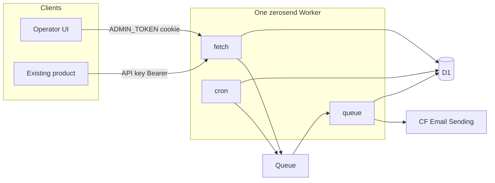

# Zerosend roadmap

Self-hosted email platform: **one Worker**, simple UI, **no user accounts**. Inspired by [EmailFlare](https://github.com/0xdps/emailflare) (Cloudflare send + admin/API) and [Resend Automations / Templates](https://resend.com/features/automations).

Each phase is separately deliverable.

**Out of scope:** multi-tenant SaaS, user tables, Better Auth as the v1 login, contacts/segments/conditions, broadcasts, inbound, domain-onboarding UI, Cloudflare Workflows, embedding zerosend _inside_ another product Worker.

---

## How it sits next to existing projects

**Zerosend is a separate app you deploy once.** Other products (openenvx-cloud, etc.) do **not** import it. They call it like Resend:

```
ZEROSEND_URL=https://zerosend.example.com
ZEROSEND_API_KEY=zs_live_…
```

```ts
await fetch(`${ZEROSEND_URL}/v1/emails`, {
  method: "POST",
  headers: { Authorization: `Bearer ${ZEROSEND_API_KEY}` },
  body: JSON.stringify({ from, to, subject, template: { id, variables } }),
});
```

**Inside zerosend: one product Worker.** Dashboard, `/v1` REST, and (from Phase 5) queue/cron handlers share `apps/zerosend` — the [EmailFlare Worker path](https://github.com/0xdps/emailflare/blob/trunk/docs/CLOUDFLARE.md), not their Docker split. Marketing and docs live in `apps/landing` (separate Worker). Deploy both with Wrangler — see [DEPLOY.md](../DEPLOY.md).



---

## Auth (no users)

EmailFlare Worker auth is **not** a user system:

| Lane | Who | Mechanism |
| --- | --- | --- |
| Operator UI | You | Env `ADMIN_TOKEN` posted to login → JWT cookie (`isLoggedIn: true`, no user id). `SESSION_SECRET` signs the cookie. |
| Product apps | Other Workers/servers | Bearer API keys, SHA-256 hashed in D1. |

Zerosend copies that split:

- [x] **Dashboard:** one password field (`ADMIN_TOKEN`). No accounts, no signup, no users table.
- [x] **`/v1`:** hashed API keys (`zs_live_…`). Create/revoke in Settings. Other projects only ever see this lane.
- [x] **Do not** put the send key in the browser as the only UI auth — EmailFlare keeps admin token and send keys separate on purpose.

### AuthPort (bridge for existing auth later)

v1 implements a small adapter so the UI gate can be swapped without rewriting routes:

```ts
type Principal = {
  kind: "admin" | "api_key" | "external";
  id: string;
  scopes: string[];
};

interface AuthAdapter {
  authenticate(request: Request): Promise<Principal | null>;
}
```

- [x] **Now:** `AdminTokenAdapter` (cookie session) for UI routes; `ApiKeyAdapter` (Bearer) for `/v1`.
- [ ] **Later:** `ExternalAdapter` — verify a JWT from an existing product (JWKS / shared secret) or Cloudflare Access. Dashboard `kind: "external"`; `/v1` stays API keys so product servers never need a user session.

---

## Simple UI

EmailFlare-small, one nav, no user/org settings:

- [x] `/login` — admin token
- [x] `/` — logs (or empty state until Phase 2)
- [ ] `/templates` — Phase 3
- [ ] `/automations` — Phase 4+
- [x] `/settings` — API keys + default from address

No user management, no billing, no domain wizard.

---

## Phase 1 — Shell + keys

**You can:** deploy zerosend alone, sign in with `ADMIN_TOKEN`, create an API key.

- [x] Single Worker (`apps/zerosend` — product; `apps/landing` optional)
- [x] EmailFlare login + cookie session (`ADMIN_TOKEN`, `SESSION_SECRET`)
- [x] `api_keys` table (hash, prefix, scopes, revoke)
- [x] `AuthAdapter` interface wired; only admin + api_key adapters
- [x] Minimal chrome + Settings

**Does not include:** sending, editor, automations.

---

## Phase 2 — Transactional send

**You can:** from another project, `POST /v1/emails` with the API key and see the message in zerosend `/logs`.

- [ ] Cloudflare **Email Sending** (`env.EMAIL.send` from an onboarded domain), not Email Routing verified-destination send
- [ ] `email_logs`
- [ ] REST: `POST /v1/emails` `{ from, to, subject, html?, text? }`
- [ ] README snippet: `ZEROSEND_URL` + `ZEROSEND_API_KEY`

**Does not include:** templates, automations, Queue.

---

## Phase 3 — Visual templates

**You can:** design in OpenEnvX, publish, send `template: { id, variables }` from the other project.

- [ ] `file:` to sibling `editor-core` `@openenvx/driver-email` (+ workbench, html, core). Not `DEFAULT_HTML_STUDIO_PLUGINS`
- [ ] Client-only editor: `WorkbenchShell` + `EmailBlocksPlugin` (see `apps/email-demo` in editor-core)
- [ ] Scene JSON is truth; publish snapshots HTML/text so send/queue never import OpenEnvX
- [ ] `{{{VAR}}}` interpolation owned by zerosend

---

## Phase 4 — Instant automations

**You can:** `POST /v1/events` `{ event, email, payload }` → welcome email, no delay.

- [ ] Steps: `trigger`, `send_email` only; send inline in the request
- [ ] Enabled automations immutable (duplicate to edit)
- [ ] Simple vertical step list

---

## Phase 5 — Delays (Queue + Cron)

**You can:** wait 10 minutes (or 3 days), then send.

- [ ] Same Worker: custom `main` wraps Start `fetch` + `queue` + `scheduled`
- [ ] Queue delay ≤ 24h; D1 `wake_at` + cron for longer (Resend max 30 days)
- [ ] Vitest with fake clock/queue/email

---

## Phase 6 — Wait for event

**You can:** wait for `order.completed` with a timeout, then branch.

- [ ] Connections: `default` | `event_received` | `timeout`
- [ ] Run inspector timeline

---

## Phase 7 — Docs in the same app

**You can:** copy curl from `/docs` or README (not a second deployed docs site).

- [ ] `/v1/emails`, templates, events, automations, runs
- [ ] How existing projects set `ZEROSEND_URL` / `ZEROSEND_API_KEY`

---

## Architecture (from Phase 5)



Work stays in this repo except `file:` to editor-core.

## First delivery

- [ ] **Phase 1 + 2:** deploy zerosend, log in, mint a key, send from another app, see logs.
