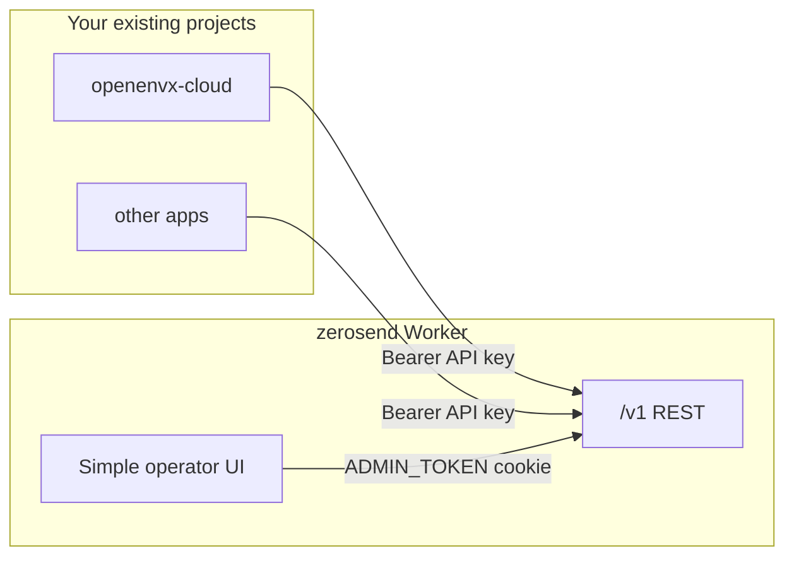
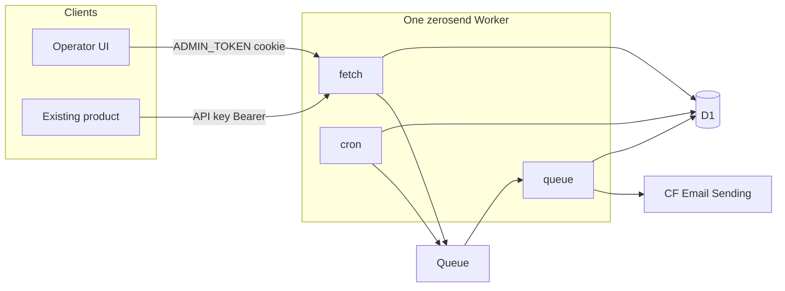

# Zerosend roadmap

Self-hosted email platform: **one Worker**, simple UI, **no user accounts**.

Two tracks, in order:

1. **[EmailFlare](https://www.emailflare.dev/)** - the sending layer Cloudflare Email Sending is missing (API, keys, logs, templates, domains). Each phase below is usable on its own.
2. **Then automations** - [Resend Automations](https://resend.com/features/automations) on top of that sending layer.

**Zerosend ≠ EmailFlare copy.** Same job, different shape:

| EmailFlare | Zerosend |
| --- | --- |
| Docker _or_ Workers | Workers only |
| 50 React Email layouts + themes | OpenEnvX visual templates |
| `POST /v1/send` | `POST /v1/emails` (Resend-shaped) |
| No automations | Automations after the sending product works |

**Out of scope:** multi-tenant SaaS, user tables, Better Auth as the v1 login, contacts/segments/payload conditions, broadcasts, inbound, Cloudflare Workflows, Docker/Railway, React Email layout catalog, embedding zerosend _inside_ another product Worker. **Projects** are in scope (Phase 5): they namespace templates / automations / keys for one operator, they are not a second Cloudflare account.

---

## How it sits next to existing projects

**Zerosend is a separate app you deploy once per Cloudflare account.** Other products (openenvx-cloud, etc.) do **not** import it. They call it like Resend:

```
ZEROSEND_URL=https://zerosend.example.com
ZEROSEND_API_KEY=zs_live_…
```

```ts
await fetch(`${ZEROSEND_URL}/v1/emails`, {
  method: 'POST',
  headers: { Authorization: `Bearer ${ZEROSEND_API_KEY}` },
  body: JSON.stringify({ from, to, subject, template: { id, variables } }),
});
```

**Inside zerosend: one product Worker.** Dashboard, `/v1` REST, and (from Phase 9) queue/cron handlers share `apps/zerosend` - the [EmailFlare Worker path](https://github.com/0xdps/emailflare/blob/trunk/docs/CLOUDFLARE.md), not their Docker split. Marketing and docs live in `apps/landing` (separate Worker). Deploy both with Wrangler - see [DEPLOY.md](../DEPLOY.md).



### Instance vs project

`env.EMAIL.send` can only use sending domains verified on **this Worker’s Cloudflare account**. A **project** is a namespace on that instance so templates, automations, and keys for openenvx-cloud do not sit in the same lists as another product. Still one `ADMIN_TOKEN`. No users, no members.

| Situation | What you do |
| --- | --- |
| Several domains on the **same** CF account | One instance. Phase 4 lists all of them. Domains are instance-wide; any project may send from a verified `from`. |
| Domains on **different** CF accounts | Deploy another zerosend (another Worker, D1, `ADMIN_TOKEN`). A project cannot attach account B’s domains to account A’s Email binding. |
| Several of _your_ products on one instance | One **project** each (Phase 5). Own templates, automations, keys. Shared domains. `/v1` key only sees that project’s templates and workflows. |

Do not use projects to fake a second Cloudflare account. That is a second deploy.

---

## Auth (no users)

EmailFlare Worker auth is **not** a user system:

| Lane | Who | Mechanism |
| --- | --- | --- |
| Operator UI | You | Env `ADMIN_TOKEN` posted to login → JWT cookie (`isLoggedIn: true`, no user id). `SESSION_SECRET` signs the cookie. |
| Product apps | Other Workers/servers | Bearer API keys, SHA-256 hashed in D1. |

Zerosend copies that split:

- [x] **Dashboard:** one password field (`ADMIN_TOKEN`). No accounts, no signup, no users table.
- [x] **`/v1`:** hashed API keys (`zs_live_…`). Create/revoke in Settings. Other projects only ever see this lane.
- [x] **Test keys:** `zs_test_…` (Phase 1) - same as EmailFlare `eftest_`; sends never leave the dashboard.
- [x] **Do not** put the send key in the browser as the only UI auth - EmailFlare keeps admin token and send keys separate on purpose.

### AuthPort (bridge for existing auth later)

v1 implements a small adapter so the UI gate can be swapped without rewriting routes:

```ts
type Principal = {
  kind: 'admin' | 'api_key' | 'external';
  id: string;
  scopes: string[];
};

interface AuthAdapter {
  authenticate(request: Request): Promise<Principal | null>;
}
```

- [x] **Now:** `AdminTokenAdapter` (cookie session) for UI routes; `ApiKeyAdapter` (Bearer) for `/v1`.
- [ ] **Later:** `ExternalAdapter` - verify a JWT from an existing product (JWKS / shared secret) or Cloudflare Access. Dashboard `kind: "external"`; `/v1` stays API keys so product servers never need a user session.

---

## Simple UI

EmailFlare-small, one nav, no user/org settings:

- [x] `/login` - admin token
- [x] `/` - logs (empty until Phase 1; project-filtered from Phase 5)
- [x] `/mailbox` - Phase 1 test inbox
- [ ] `/domains` - Phase 4 (instance-wide)
- [ ] `/templates` - Phase 6 (current project)
- [ ] `/automations` - Phase 7 list; Phase 8 canvas (current project)
- [x] `/settings` - API keys + default from address (keys are per-project from Phase 5)

No user management, no billing.

---

# Track 1 - EmailFlare sending

Each phase is a product you can run. Later phases add to it; they do not replace it.

---

## Phase 0 - Shell + keys

**You can:** deploy zerosend alone, sign in with `ADMIN_TOKEN`, create an API key.

- [x] Single Worker (`apps/zerosend` - product; `apps/landing` optional)
- [x] EmailFlare login + cookie session (`ADMIN_TOKEN`, `SESSION_SECRET`)
- [x] `api_keys` table (hash, prefix, scopes, revoke)
- [x] `AuthAdapter` interface wired; only admin + api_key adapters
- [x] Minimal chrome + Settings

**Does not include:** sending. This phase is the floor everything else stands on.

---

## Phase 1 - Test send (first usable)

**You can:** from another project (or the dashboard playground), `POST /v1/emails` with a `zs_test_` key and read the message in zerosend - no Cloudflare Email Sending, no DNS.

EmailFlare’s test keys / in-house mailbox: [emailflare.dev](https://www.emailflare.dev/).

- [x] `zs_test_…` keys; sends are stored, never handed to `env.EMAIL`
- [x] `email_logs` + `/mailbox` HTML/text preview
- [x] REST: `POST /v1/emails` `{ from, to, subject, html?, text? }`
- [x] Playground: send a test from the UI
- [x] README snippet: `ZEROSEND_URL` + `ZEROSEND_API_KEY`

**Does not include:** live delivery, templates, domains, automations.

---

## Phase 2 - Live send

**You can:** mint a `zs_live_` key, send from another project, and the message hits a real inbox.

- [x] Cloudflare **Email Sending** (`env.EMAIL.send` from an onboarded domain), not Email Routing verified-destination send
- [x] Live logs: recipient, from, API key prefix, Cloudflare message id, status, error
- [x] Default from address in Settings (until Phase 4 domains)

**Does not include:** templates, batch, domains, automations.

---

## Phase 3 - Production send API

**You can:** treat `/v1/emails` like EmailFlare’s send endpoint - retries are safe, bursts are capped, one call can fan out.

- [ ] `to`: one address or array (max 50), deduped
- [ ] `fromName`, `replyTo`
- [ ] `Idempotency-Key` header - repeat returns the stored result
- [ ] Per-key rate limit + `X-RateLimit-Limit` / `Remaining` / `Reset`

**Does not include:** templates, domains, automations.

---

## Phase 4 - Domains

**You can:** add every sending domain on **this** Cloudflare account in the UI, copy DKIM / return-path records, see verify status - no Wrangler/CLI for DNS.

- [ ] `/domains` - add, list, DNS records, verified/pending (N domains, one instance)
- [ ] Keys may be scoped `global` | per-domain | `multi` (EmailFlare model)
- [ ] Live send rejects `from` that is not on a verified domain for this account

**Does not include:** projects (Phase 5), templates (Phase 6), automations (Phase 7+). **Not planned:** provisioning a _different_ Cloudflare account (deploy another instance).

---

## Phase 5 - Projects

**You can:** keep openenvx-cloud and another product from sharing a template or automation list, without a second Worker.

- [ ] `projects` table; seed a **default** project and attach keys created in Phases 0–4
- [ ] Rail switcher - still one `ADMIN_TOKEN`, no members
- [ ] Keys belong to a project. That key can only use that project’s templates and fire that project’s automations
- [ ] `/templates` and `/automations` are the current project. `/domains` stays instance-wide
- [ ] Logs and mailbox filter to the current project

**Does not include:** the template editor (Phase 6), automations, users on a project.

---

## Phase 6 - Visual templates

**You can:** design in OpenEnvX, publish, send `template: { id, variables }` from the other project.

EmailFlare’s “templates you manage, not code” - visual editor instead of React Email layouts.

- [ ] Templates belong to the current project
- [ ] `file:` to sibling `editor-core` `@openenvx/driver-email` (+ workbench, html, core). Not `DEFAULT_HTML_STUDIO_PLUGINS`
- [ ] Client-only editor: `WorkbenchShell` + `EmailBlocksPlugin` (see `apps/email-demo` in editor-core)
- [ ] Scene JSON is truth; publish snapshots HTML/text so send/queue never import OpenEnvX
- [ ] `{{{VAR}}}` interpolation owned by zerosend
- [ ] Preview rendered HTML in the dashboard before a live send

**Does not include:** automations.

---

# Track 2 - Automations

Sending product is already usable. These phases add event-driven flows.

---

## Phase 7 - Instant automations

**You can:** `POST /v1/events` `{ event, email, payload }` → welcome email, no delay.

- [ ] Automations belong to the current project; a key only matches that project’s workflows
- [ ] Steps: `trigger`, `send_email` only; send inline in the request
- [ ] Enabled automations immutable (duplicate to edit)
- [ ] `/automations` list (create, enable, duplicate). Graph editor is Phase 8.

---

## Phase 8 - Automation canvas

**You can:** open an automation and edit it on a node canvas like [Resend Automations](https://resend.com/features/automations).

- [ ] `@xyflow/react` on `/automations/:id` (pan, zoom; no minimap)
- [ ] Nodes for kinds that exist: `trigger`, `send_email`. Later phases add kinds to this same canvas.
- [ ] Graph JSON in D1 is truth; React Flow is the view. Send/queue never import xyflow.
- [ ] Click a node to configure (event name, template). Edges are the flow.

**Does not include:** delay/wait nodes, payload conditions, contacts/segments.

---

## Phase 9 - Delays (Queue + Cron)

**You can:** wait 10 minutes (or 3 days), then send.

- [ ] Same Worker: custom `main` wraps Start `fetch` + `queue` + `scheduled`
- [ ] Queue delay ≤ 24h; D1 `wake_at` + cron for longer (Resend max 30 days)
- [ ] `delay` node on the Phase 8 canvas
- [ ] Vitest with fake clock/queue/email

---

## Phase 10 - Wait for event

**You can:** wait for `order.completed` with a timeout, then branch.

- [ ] `wait_for_event` node; edges `default` | `event_received` | `timeout`
- [ ] Run inspector timeline (not a second graph editor)

---

## Phase 11 - Docs in the same app

**You can:** copy curl from `/docs` or README (not a second deployed docs site).

- [ ] `/v1/emails`, templates, events, automations, runs
- [ ] How existing projects set `ZEROSEND_URL` / `ZEROSEND_API_KEY`

---

## Architecture (from Phase 9)



Work stays in this repo except `file:` to editor-core.

## First delivery

- [x] **Phase 0 + 1:** deploy, log in, mint a `zs_test_` key, send from another app or the playground, read it in `/mailbox`. No Cloudflare Email Sending yet.
- [x] **Phase 2:** same flow with `zs_live_`, real inbox.
